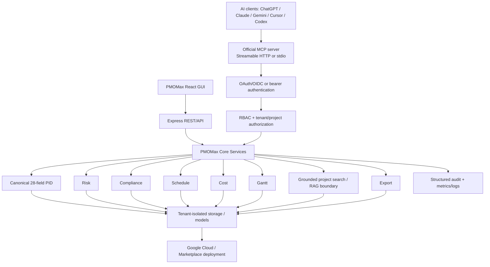

# Enterprise architecture

The original runtime remains React/Vite served by Express. Existing `/api/*` GUI routes, Gemini helpers, Marketplace usage and entitlement, exports, static assets, Docker deployer, schemas, and Google manifests remain in place. The enterprise router is mounted at `/api/enterprise/v1`; both it and MCP call `lib/enterprise/projectService.mjs`, which owns canonical normalization, persistence, RBAC, tenant isolation, analysis, planning, and export behavior.

The MCP process is horizontally scalable and stateless. Durable state belongs to the core service. Its HTTP client applies bounded connection pools, concurrency limits, deadlines, retry-with-jitter only for transient failures, and safe error translation. Production should replace local filesystem persistence with the existing organization-approved durable volume or a compatible tenant-aware storage adapter before multi-instance writes.
